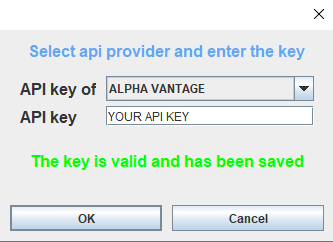

# Stock analysis

The software has currently 2 main goals:  
1. Simplify the stock selection process.  
2. Educate myself on how companies operate both financially and socially.

## Features

* Company general information
* Financial statement:
    1. Income statement
    2. Balance sheet
    3. Cash Flow
* Key ratios
* Interface which make it easy to add different api providers 
## Images

Company overview

 
Income statement:

API key updater:

## Libraries and frameworks
<b>Hibernate</b> for data persistence : https://hibernate.org/  
<b>Gson</b> for json parsing : https://github.com/google/gson

## Software licence
MIT